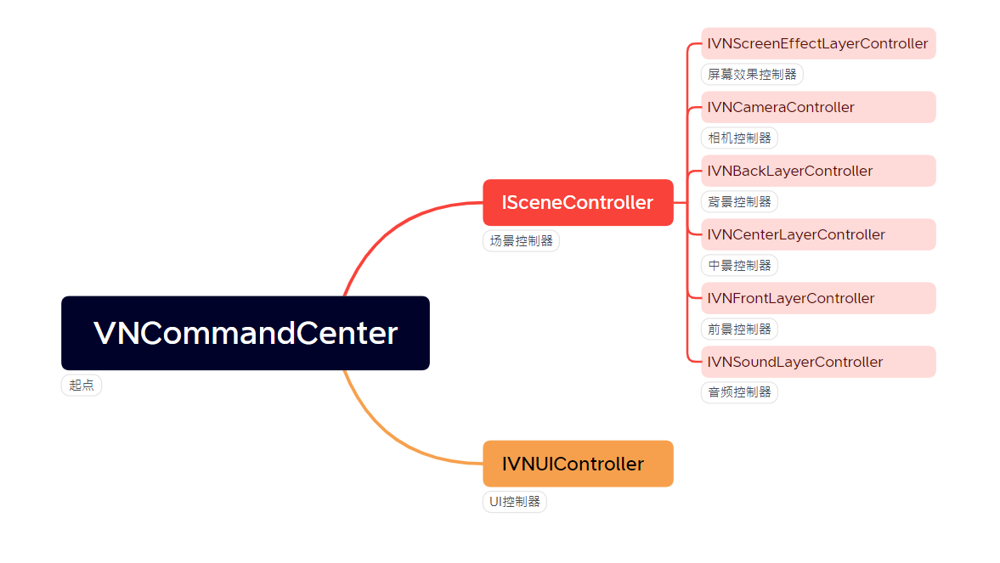

## 1：简介
LWVN - **LightWeight** Visual Novel
LWVN是一个极其轻量级的VisualNovel框架，特点是：
1. 简陋：反正初始功能很少
2. 方便修改：源码非常简单，并在降低耦合便于修改的同时尽可能减少中间层以便于梳理和调整

构建Unity版本：2020.3.44f1
渲染管线：URP 2D
第三方依赖：
* DOTween（动画控制）
* Newtonsoft.Json（用于对数据序列化/反序列化）

## 2：核心思路
一般的gal游戏，最重要的三个元素为：
1. 对话框
2. 角色立绘
3. 背景图片

根据上述元素，可以划分出三个图层：
1. 前景层（用于对话框、菜单等）
2. 中景层（用于显示角色立绘或者其他物品）
3. 背景层（用于显示背景图片）

然后，考虑其他功能，还可以划分出：
1. 音频层
2. 屏幕效果层
3. UI层
4. ...

通过对这些层的操作，可以显示出想要显示的画面。而每一个层都有特定的信息，例如对于前景层，可以有说话人的名字，说话内容等等。

因此，可以定义一系列的**层控制器**操控各种**功能组件**来控制各个层表现，并通过提供**控制器信息**作为控制器参数来控制控制器行为，控制器参数可以使用**脚本解析器**来解析剧情脚本生成

LWVN的设计基于以上抽象。

## 3：文件组成
* **Common**：一般文件，例如基本接口/全局信息管理等等
* **Components**：组件，例如音频播放器、对话框背景组件等等
* **Controllers**：控制器，主要用于控制各个单元
* **Enum**：枚举条目
* **MiniGames**：内嵌小游戏相关
* **ResourcesProvider**：资源提供器
* **VNInfos**：控制器信息
* *VNCommandCenter*：控制中心，用于总体调度
* *LWVN*：全局设置

注意，以I开头命名的控制器为抽象接口（但是根据实际情况，可能会是以抽象类声明的），**_DefaultImpl**文件夹下是对接口的实际实现，可以直接使用、做扩充或者参考其实现方式来实现自己的组件

主要依赖关系：
